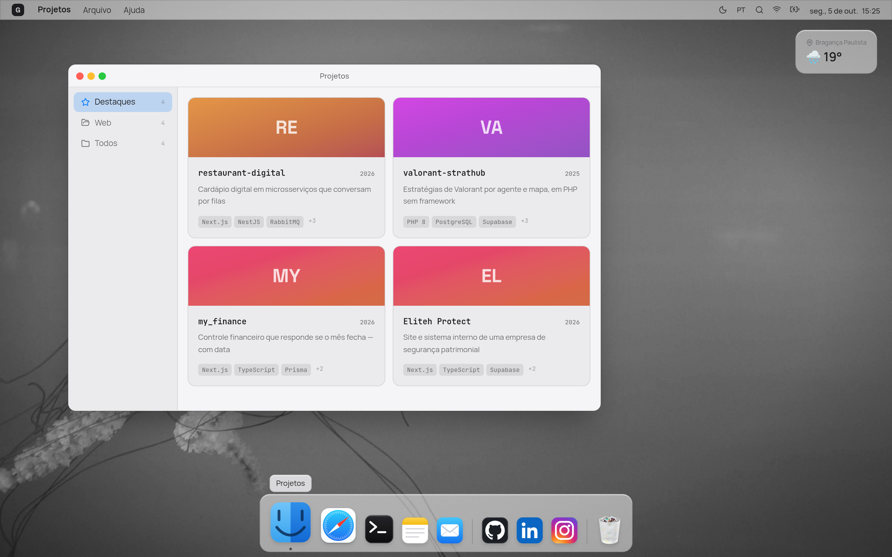
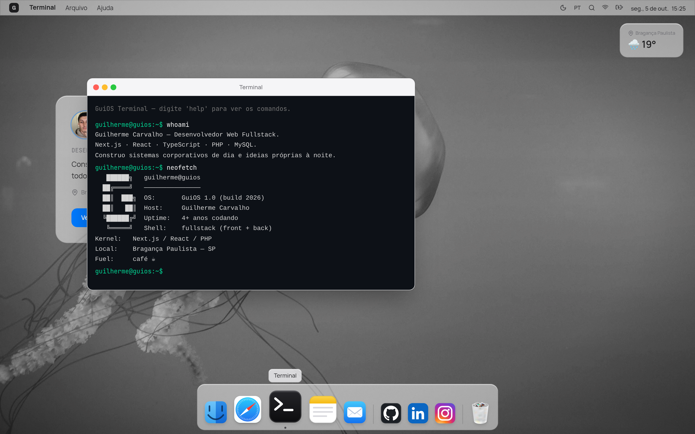
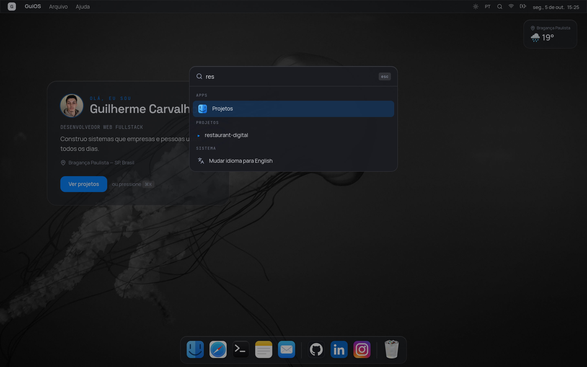
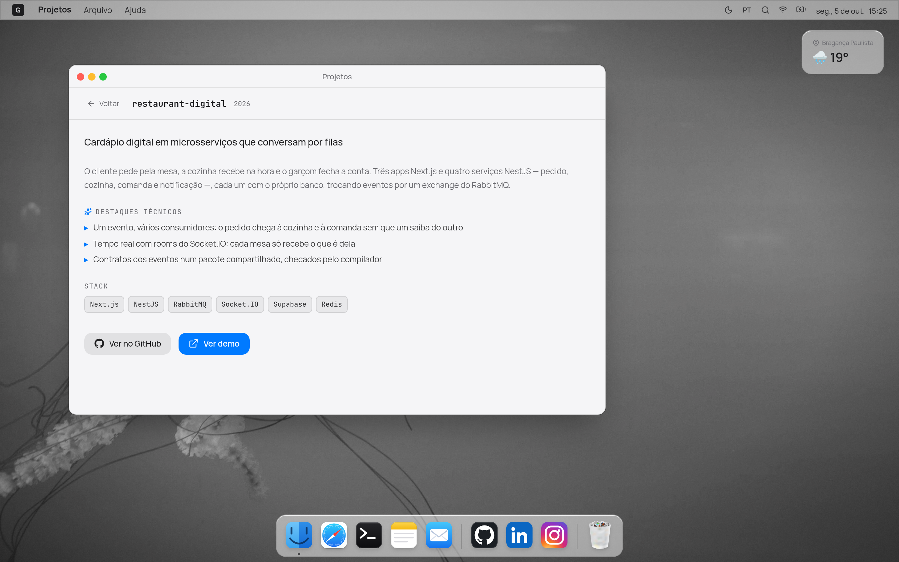
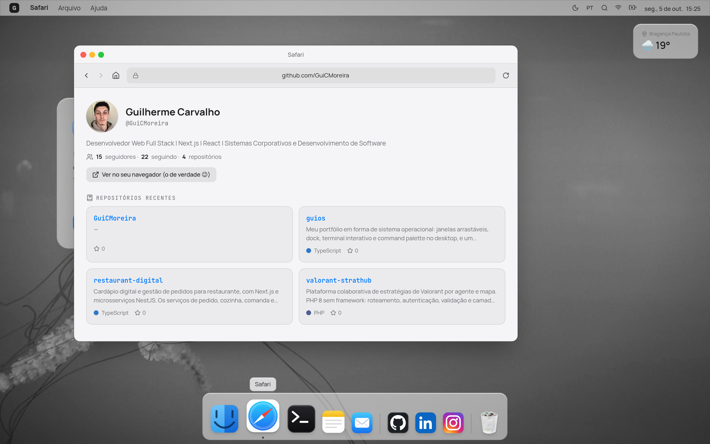
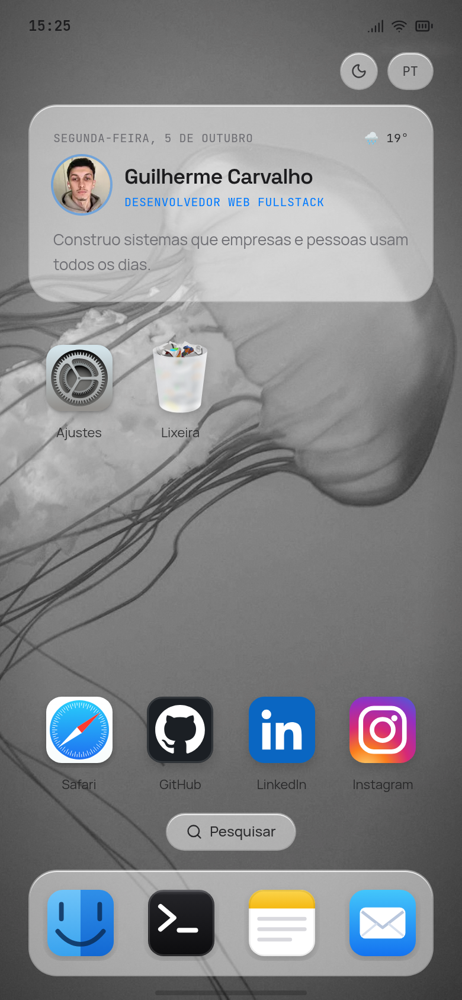
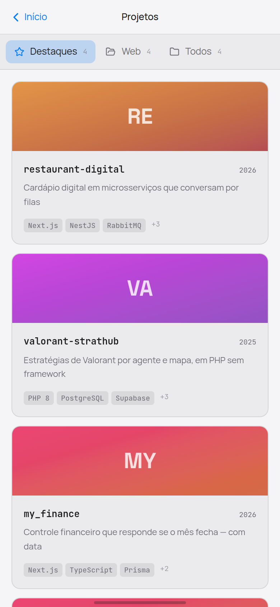
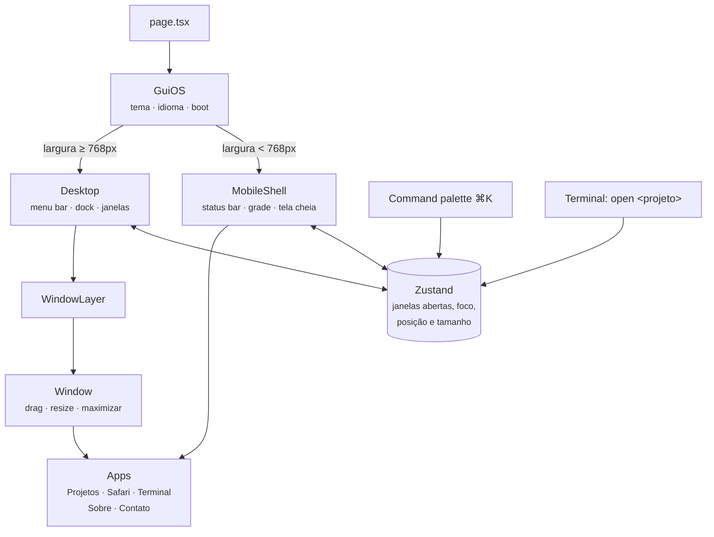

<div align="center">

# 🖥️ GuiOS

**Um portfólio que não é um site: é um sistema operacional.**

Janelas arrastáveis, dock, terminal de verdade e command palette no desktop. No celular, o mesmo
conteúdo vira um smartphone.


**[guicmoreira.vercel.app](https://guicmoreira.vercel.app)**

</div>

<p align="center">
  
</p>

---

## Sumário

- [O que é](#o-que-é)
- [Telas](#telas)
- [Como funciona](#como-funciona)
- [Decisões técnicas](#decisões-técnicas)
- [Rodando localmente](#rodando-localmente)
- [Estrutura](#estrutura)
- [Créditos](#créditos)

---

## O que é

Portfólio costuma ser uma página com foto, lista de tecnologias e cards de projeto. O GuiOS
apresenta o mesmo conteúdo como um sistema operacional inspirado no macOS: cada seção é um app,
abre numa janela e pode ser arrastada, redimensionada, minimizada e maximizada.

| App            | O que faz                                                                                      |
| -------------- | ---------------------------------------------------------------------------------------------- |
| 📁 **Projetos** | Navegador estilo Finder, com destaques, stack e links para código e demo                       |
| 🧭 **Safari**   | Navegador com histórico; `github.com` mostra o perfil real, buscado na API pública do GitHub   |
| ⌨️ **Terminal** | `help`, `whoami`, `ls projetos`, `open <projeto>`, `neofetch`, `hire --me` e alguns easter eggs |
| 📝 **Sobre**    | Bio, linha do tempo da carreira e o painel "Sobre este Dev"                                     |
| ✉️ **Contato**  | GitHub, LinkedIn, Instagram e e-mail                                                            |
| ⌘ **⌘K**        | Command palette para abrir apps, projetos e ações do sistema                                    |

Tudo em **português e inglês** (detecção automática, botão na barra de menu ou `lang` no
terminal), nos temas **claro e escuro**.

---

## Telas

<table>
<tr>
<td width="50%">

<p align="center"><em>Terminal funcional, com histórico nas setas</em></p>
</td>
<td width="50%">

<p align="center"><em>Command palette (⌘K) no tema escuro</em></p>
</td>
</tr>
<tr>
<td width="50%">

<p align="center"><em>Detalhe de projeto, com destaques técnicos</em></p>
</td>
<td width="50%">

<p align="center"><em>O Safari busca o perfil real na API do GitHub</em></p>
</td>
</tr>
</table>

<p align="center">
  
  &nbsp;&nbsp;
  
  <br><em>Abaixo de 768px o desktop dá lugar a um smartphone, com grade de apps e telas cheias</em>
</p>

---

## Como funciona



O estado de todas as janelas — aberta, minimizada, maximizada, posição, tamanho e quem tem o foco
— vive numa única store do Zustand. Dock, command palette e o comando `open` do terminal não
sabem nada sobre janelas: só chamam `openApp(id)`. Os apps são os mesmos componentes no desktop e
no celular; muda apenas a moldura em volta deles.

---

## Decisões técnicas

<details>
<summary><strong>Arrastar e redimensionar sem re-render</strong></summary>

Uma janela que re-renderiza a cada pixel arrastado engasga com o conteúdo pesado dentro dela. A
posição e o tamanho ficam em *motion values* do Motion, atualizados direto no DOM durante o gesto;
o React só fica sabendo quando o gesto termina. O redimensionamento pelas bordas usa pointer
events puros sobre esses mesmos valores.

</details>

<details>
<summary><strong>Canais separados para arrastar e maximizar</strong></summary>

A primeira versão usava o mesmo `x`/`y` para as duas coisas, e maximizar uma janela arrastada
fazia ela "voltar" para a posição antiga ao soltar. Hoje o drag é dono de `x`/`y` e a maximização
tem os próprios `tx`/`ty`, que compensam a posição arrastada. O alvo da maximização é medido do
DOM, então nunca fica fora de sincronia com o que está na tela.

</details>

<details>
<summary><strong>Um storage que não quebra</strong></summary>

Tema, idioma e "já viu o boot" ficam no `localStorage` e no `sessionStorage`. Só que acessar o
storage pode lançar `SecurityError` — cookies bloqueados, iframe em sandbox, modo privado antigo.
Todo acesso passa por um wrapper: a leitura devolve `null` e a escrita vira no-op. O site perde a
memória, mas não para de funcionar.

</details>

<details>
<summary><strong>Desktop ou celular pela largura, sem flash</strong></summary>

A escolha entre `Desktop` e `MobileShell` usa `useSyncExternalStore` sobre um `matchMedia`, e não
um `useEffect` com `useState`. Assim a troca acontece ao girar o tablet ou redimensionar a janela,
sem renderizar o layout errado primeiro.

</details>

<details>
<summary><strong>Acessibilidade num site que imita um sistema</strong></summary>

Uma interface de janelas é fácil de deixar inacessível. O GuiOS respeita `prefers-reduced-motion`
(boot, janelas e transições), funciona inteiro pelo teclado — dock, janelas e palette — e mantém o
foco visível. Os pontos apontados pelo Lighthouse, como landmark `main` e nomes acessíveis, foram
corrigidos.

</details>

---

## Rodando localmente

```bash
git clone https://github.com/GuiCMoreira/guios.git
cd guios
npm install
npm run dev
```

Abra <http://localhost:3000>. Não precisa de banco nem de variável de ambiente.

```bash
npm run lint       # ESLint
npx tsc --noEmit   # typecheck
npm run build      # build de produção
```

O deploy é na Vercel: importar o repositório basta, sem configuração extra.

---

## Estrutura

```
src/
├── app/                   layout, página, metadata, sitemap e imagem OpenGraph
├── components/
│   ├── os/                desktop: menu bar, dock, janelas, boot, palette
│   ├── mobile/            moldura de smartphone
│   ├── apps/              Projetos, Safari, Terminal, Sobre, Contato
│   └── ui/                ícones
├── data/                  projetos, carreira e itens da lixeira
└── lib/                   store, i18n, tema, wallpaper e storage seguro
docs/
├── screenshots/           imagens deste README
├── qa/                    roteiros de QA executados
└── superpowers/           especificação e plano de implementação
```

O histórico de versões, do lançamento ao Safari, está no [CHANGELOG](CHANGELOG.md).

---

## Créditos

- Ícones da Lixeira, Safari e Ajustes: [WhiteSur icon theme](https://github.com/vinceliuice/WhiteSur-icon-theme) (GPL-3), de Vince Liuice.
- Wallpapers: [Lorem Picsum](https://picsum.photos/) (fotos do Unsplash).
- Demais ícones de apps: recriações próprias em SVG.
